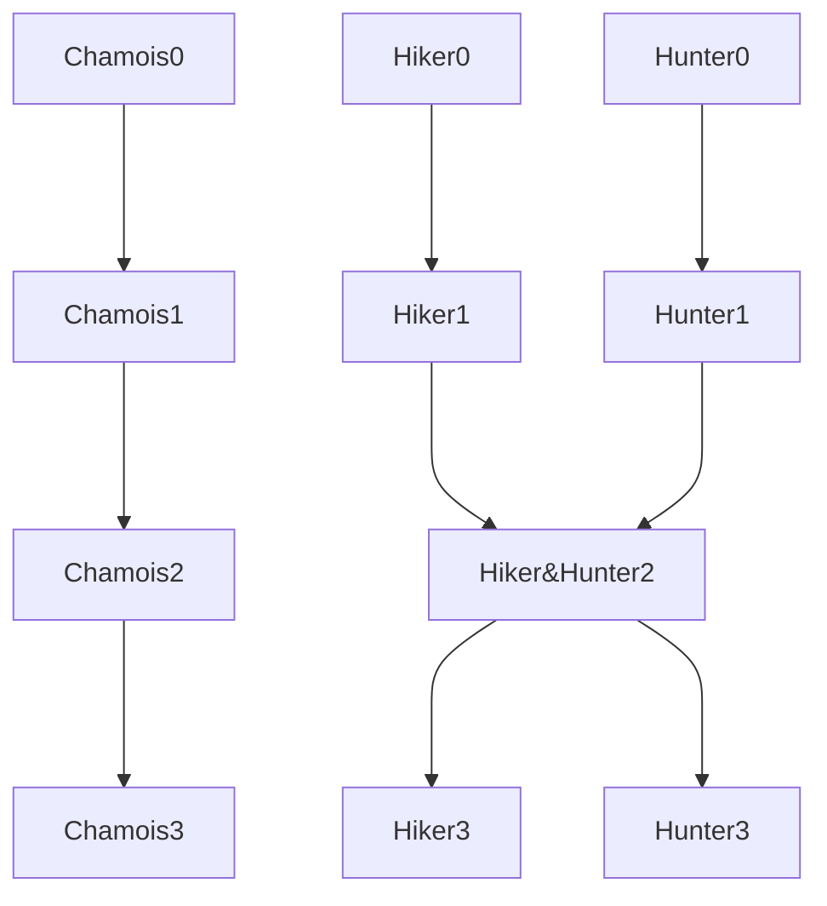

Game Design Document

# Intro
This is a serious game with raises awareness on the effect of human behaviors on the fauna of National Park of Savoie

The game is open-world where the player can explore freely, interact with objects and creatures, and do quests.

Even thought the map is relatively small, we still need to prevent players from getting lost on the map (there won't be fast travel) or get bored.

The story would be mostly linear as it is very hard to design a non linear story and an open world. Some stories need to be unlocked in order to start other stories.

It would be ideal to have different solution to a problem (ex. The answer to a question can be found by observing or directly asking the scientist). We can also encourage the player to search online (but in a correct way) as doing research online is a valid way of learning and might inspire curiosity.

## Ideas
In order to make the world more interesting, we can:
- Add puzzle in places (Korak seeds in BOTW)
- Change visuals according to seasons

# Characters
There are 3 characters in the game: the chamois, the hunter and the hiker

## Chamois
The chamois is a female who is pregnant and needs to survive as long as possible and give birth to the baby

### Gameplay
There are several stats that keeps the chamois alive: health, hunger, stress, exp, which are affected by these actions:
- Walking: +exp, +hunger
- Eat grass: +health, -hunger, -stress
- Being tripped by trash: -health
- Being next to wolves: +stress
- Being bitten by wolves: -health

The chamois need to eat and avoid danger in order to keep the stats normal and survive until the birth of the baby

(The exp was used to enlarge the circle of FogOfWar, but it was canceled since there's no reason for a chamois to discover his own habitat)

### Scenario
Through the eyes of the chamois, we can experience how the human activities have changed the life of animals (for better or for worse)

## Huntress
The huntress is a character with a pistol

### Gameplay
The huntress needs to talk to NPC in the park in order to hunt hurt chamois, she's also capable of shooting other creature, but will get a penalty if she shoots the wrong ones

The hunter also helps keeping the park clean by picking up trash

(The huntress will only be able to hunt during hunting seasons)

The mechanism of the hunter is not about providing the player a enjoyable shooter game like Hotline Miami, as the usage of guns is very serious topic in real world. (It might even be possible to simplify the shooting process?)

### Scenario 
As hunting is a very controversial topic, it's important to teach the function of hunters in regions where predators are in low number

We can even implement the ideas of the opposing side in the game in order to have a debate on the subject

Hunting for biodiversity, not trophy hunting

Possible story line: At the start of the game, the girl does a stage on hunting in order to get a license for hunting (https://www.onf.fr/chasse/+/cb4::chasse-la-journee-dans-là-reserve-nationale-de-chasse-et-de-faune-sauvage-des-bauges.html). At the exam, she need to answer questions about chamois and the woods (she has to find the questioners everywhere in the mountains)

## Hiker
The hiker does hiking routes and take pictures at each check point
### Gameplay
The hiking routes are obtained from a guide somewhere near the spawning point (or approches automatically). After getting a route, he needs to find the check points and validate them. She will also take a photo at the check pont (photo provided by future trip to the park)

## Between the three
It is possible for the 3 characters to interact with each other since it is possible to switch between players in the middle of the game. In that case, we need a system that manages the movement of the player and also prepares the dialog when meeting with another character

# The World 

## NPC
NPC or interactables are objects or creatures which at least one character can interact with.

With human or other chamois, the characters can have a conversation in a VisualNovel interface (for readability)

### automatic interactions
Grass being eaten 

### confirmation-required interactions
Charge ammo
Trash being picked up
Trash being thrown to the trash can

### InfoGiver
The person hides in places and give the player a tip when found (maybe need change)

### InfoChamois
Same as InfoGiver, but for chamois

### Chamois
They move to different places according to the season

### RandoGuide
Gives the hiker informations on hiking routes, should start from simpler routes to more difficult ones. The difficulty of routes can be defined by how complicated to get there (Having a big detours etc. like A Short Hike)

### WoodKeeper
As huntress to do errands for him 

### Other hikers
Might have prejudice on hunters?

### Scientists
Do research and provide answers

## Zones
### Slides
The mountains slides are only accessible by the chamois, which can be useful when dodging wolves and hunters

### Research Zones
There are scientists doing research in the park and in these zone, it's only accessible by researchers and the huntress since the huntress hunt for researches, the huntress can get special informations (maybe can even be a fast travel point?) 

## Other mechanism
### Day & Night
This mechanism has been suspended as there isn't any gameplay that uses this 

### Date
The date passes automatically, but this could be problematic if the player doesn't finish a quest for a long time, and some events require passing to a different season or time of day

# Real-world extensions
The game is envisioned not only to be played, but also to be used in the national park thanks to the localisation by GPS.

## hiking routes
As players unlock hiking routes which are inspired by real-life routes from a website, it would be interesting for people to validate the point in park using their GPS info.

## 

# Content
This section designs the scenario as well as the conversation and content in guides, encyclopedia, and achievement

## Scenarios
Ideally, the story of three characters would start in parallel but in certain situation, need the information and interaction from other characters in order to continue the story. The idea can be represented by a graph

### Topics
1. Humans are already a part of the nature
2. Trophy hunting 
3. Importance of sport?

## Contents
### Guides

### Encyclopedia 
The encyclopedia contains "static" and "dynamic", which means, the manual and notes. (But for chamois, maybe a "mental journal" would be enough)

### Achi 

# Style
This part talks about the envisioned style for image, music, writings, etc.

# Useful Infos 

## Hunting
Réserve Nationale de Chasse et de Faune Sauvage
https://www.parcdesbauges.com/fr/agir/que-fait-le-parc/valoriser-les-patrimoines/reserve-nationale-de-chasse-et-de-faune-sauvage.html#.Ysf9Ay8Rr5g

"La France comptait  580 loups sur son territoire en 2020"
https://www.onf.fr/chasse/la-chasse-en-foret/+/b78::la-chasse-un-prerequis-pour-planter-les-forets-de-demain.html

https://www.onf.fr/chasse/la-chasse-en-foret/+/5a4::cerfs-chevreuils-sangliers-trop-de-grand-gibier-nuit-aux-forets.html

## Chamois
"An impregnated female undergoes a gestation period of 170 days, after which a single kid is usually born in May or early June"